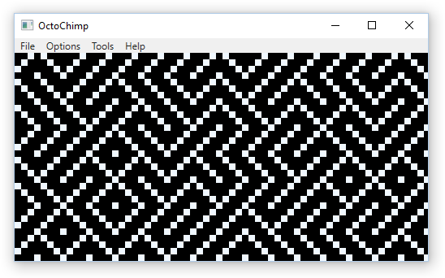
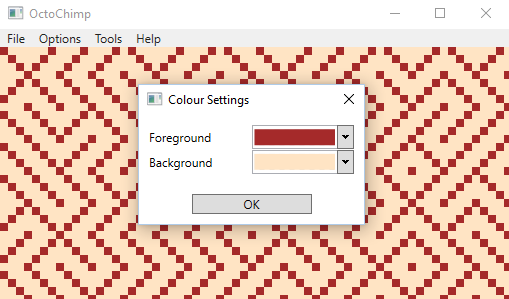
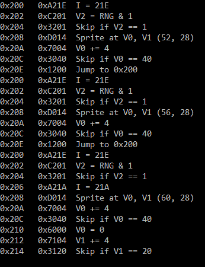

# OctoChimp
A (very incomplete) Chip-8 Emulator written in C# (+ SFML.NET).

## Screenshots
### WPF UI

### Colours

### Debug

## Status
 Status | Opcode | Description                                                                                                                      | Tests
:------:|--------|----------------------------------------------------------------------------------------------------------------------------------|-----
        | 0NNN   | Calls RCA 1802 program at address NNN. Not necessary for most ROMs.                                                              |
  ✔️     | 00E0   | Clears the screen.                                                                                                               |
  ✔️     | 00EE   | Returns from a subroutine.                                                                                                       |
  ✔️     | 1NNN   | Jumps to address NNN.                                                                                                            |
  ✔️     | 2NNN   | Calls subroutine at NNN.                                                                                                         |
  ✔️     | 3XNN   | Skips the next instruction if VX equals NN.                                                                                      | 1
  ✔️     | 4XNN   | Skips the next instruction if VX doesn't equal NN.                                                                               | 1
  ✔️     | 5XY0   | Skips the next instruction if VX equals VY.                                                                                      | 1
  ✔️     | 6XNN   | Sets VX to NN.                                                                                                                   | 1
  ✔️     | 7XNN   | Adds NN to VX.                                                                                                                   | 1
  ✔️     | 8XY0   | Sets VX to the value of VY.                                                                                                      | 1
  ✔️     | 8XY1   | Sets VX to VX or VY.                                                                                                             | 1
  ✔️     | 8XY2   | Sets VX to VX and VY.                                                                                                            | 1
  ✔️     | 8XY3   | Sets VX to VX xor VY.                                                                                                            | 1
  ✔️     | 8XY4   | Adds VY to VX. VF is set to 1 when there's a carry                                                                               |
  ✔️     | 8XY5   | VY is subtracted from VX. VF is set to 0 when there's a borrow                                                                   |
        | 8XY6   | Shifts VX right by one. VF is set to the value of the least significant bit of VX before the shift.                              |
        | 8XY7   | Sets VX to VY minus VX. VF is set to 0 when there's a borrow                                                                     |
        | 8XYE   | Shifts VX left by one. VF is set to the value of the most significant bit of VX before the shift.                                |
  ✔️     | 9XY0   | Skips the next instruction if VX doesn't equal VY.                                                                               |
  ✔️     | ANNN   | Sets I to the address NNN.                                                                                                       |
  ✔️     | BNNN   | Jumps to the address NNN plus V0.                                                                                                |
  ✔️     | CXNN   | Sets VX to the result of a bitwise and operation on a random number and NN.                                                      |
  ✔️     | DXYN   | Draws a sprite at coordinate (VX                                                                                                 |
  ✔️     | EX9E   | Skips the next instruction if the key stored in VX is pressed.                                                                   |
  ✔️     | EXA1   | Skips the next instruction if the key stored in VX isn't pressed.                                                                |
  ✔️     | FX07   | Sets VX to the value of the delay timer.                                                                                         |
  ✔️     | FX0A   | A key press is awaited                                                                                                           |
  ✔️     | FX15   | Sets the delay timer to VX.                                                                                                      | 1
  ✔️     | FX18   | Sets the sound timer to VX.                                                                                                      | 1
  ✔️     | FX1E   | Adds VX to I.                                                                                                                    |
        | FX29   | Sets I to the location of the sprite for the character in VX. Characters 0-F (in hexadecimal) are represented by a 4x5 font.     |
  ✔️     | FX33   | Stores the binary-coded decimal representation of VX                                                                             |
  ✔️     | FX55   | Stores V0 to VX (including VX) in memory starting at address I.                                                                  |
  ✔️     | FX65   | Fills V0 to VX (including VX) with values from memory starting at address I.                                                     |

## Resources
* http://emulator101.com/
* http://www.multigesture.net/articles/how-to-write-an-emulator-chip-8-interpreter/
* http://www.zophar.net/pdroms/chip8.html
